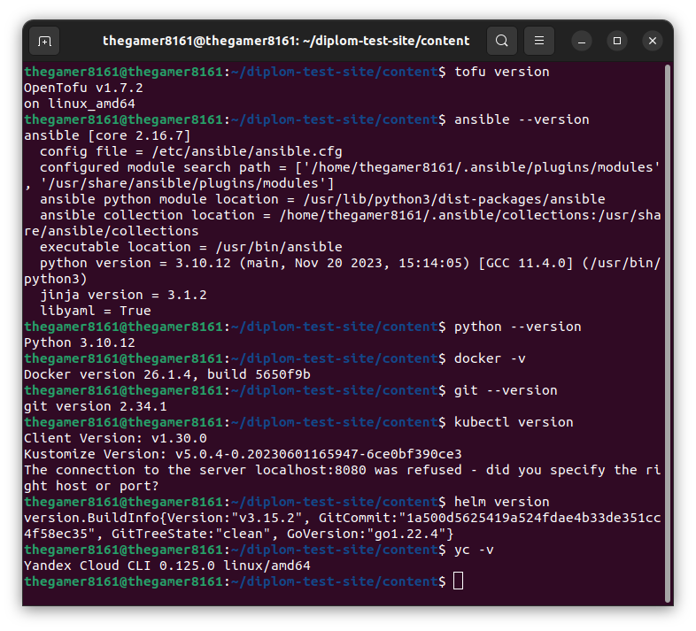

# Никоноров Денис - FOPS-8

# Дипломный практикум в Yandex.Cloud
  * [Цели:](#цели)
  * [Этапы выполнения:](#этапы-выполнения)
     * [Создание облачной инфраструктуры](#создание-облачной-инфраструктуры)
     * [Создание Kubernetes кластера](#создание-kubernetes-кластера)
     * [Создание тестового приложения](#создание-тестового-приложения)
     * [Подготовка cистемы мониторинга и деплой приложения](#подготовка-cистемы-мониторинга-и-деплой-приложения)
     * [Установка и настройка CI/CD](#установка-и-настройка-cicd)
  * [Что необходимо для сдачи задания?](#что-необходимо-для-сдачи-задания)
  * [Как правильно задавать вопросы дипломному руководителю?](#как-правильно-задавать-вопросы-дипломному-руководителю)

**Перед началом работы над дипломным заданием изучите [Инструкция по экономии облачных ресурсов](https://github.com/netology-code/devops-materials/blob/master/cloudwork.MD).**

---
## Цели:

1. Подготовить облачную инфраструктуру на базе облачного провайдера Яндекс.Облако.
2. Запустить и сконфигурировать Kubernetes кластер.
3. Установить и настроить систему мониторинга.
4. Настроить и автоматизировать сборку тестового приложения с использованием Docker-контейнеров.
5. Настроить CI для автоматической сборки и тестирования.
6. Настроить CD для автоматического развёртывания приложения.

---
## Этапы выполнения:


### Создание облачной инфраструктуры

Для начала необходимо подготовить облачную инфраструктуру в ЯО при помощи [Terraform](https://www.terraform.io/).

Особенности выполнения:

- Бюджет купона ограничен, что следует иметь в виду при проектировании инфраструктуры и использовании ресурсов;
Для облачного k8s используйте региональный мастер(неотказоустойчивый). Для self-hosted k8s минимизируйте ресурсы ВМ и долю ЦПУ. В обоих вариантах используйте прерываемые ВМ для worker nodes.

Предварительная подготовка к установке и запуску Kubernetes кластера.

1. Создайте сервисный аккаунт, который будет в дальнейшем использоваться Terraform для работы с инфраструктурой с необходимыми и достаточными правами. Не стоит использовать права суперпользователя
2. Подготовьте [backend](https://www.terraform.io/docs/language/settings/backends/index.html) для Terraform:  
   а. Рекомендуемый вариант: S3 bucket в созданном ЯО аккаунте(создание бакета через TF)
   б. Альтернативный вариант:  [Terraform Cloud](https://app.terraform.io/)  
3. Создайте VPC с подсетями в разных зонах доступности.
4. Убедитесь, что теперь вы можете выполнить команды `terraform destroy` и `terraform apply` без дополнительных ручных действий.
5. В случае использования [Terraform Cloud](https://app.terraform.io/) в качестве [backend](https://www.terraform.io/docs/language/settings/backends/index.html) убедитесь, что применение изменений успешно проходит, используя web-интерфейс Terraform cloud.

Ожидаемые результаты:

1. Terraform сконфигурирован и создание инфраструктуры посредством Terraform возможно без дополнительных ручных действий.
2. Полученная конфигурация инфраструктуры является предварительной, поэтому в ходе дальнейшего выполнения задания возможны изменения.

---
### Создание Kubernetes кластера

На этом этапе необходимо создать [Kubernetes](https://kubernetes.io/ru/docs/concepts/overview/what-is-kubernetes/) кластер на базе предварительно созданной инфраструктуры.   Требуется обеспечить доступ к ресурсам из Интернета.

Это можно сделать двумя способами:

1. Рекомендуемый вариант: самостоятельная установка Kubernetes кластера.  
   а. При помощи Terraform подготовить как минимум 3 виртуальных машины Compute Cloud для создания Kubernetes-кластера. Тип виртуальной машины следует выбрать самостоятельно с учётом требовании к производительности и стоимости. Если в дальнейшем поймете, что необходимо сменить тип инстанса, используйте Terraform для внесения изменений.  
   б. Подготовить [ansible](https://www.ansible.com/) конфигурации, можно воспользоваться, например [Kubespray](https://kubernetes.io/docs/setup/production-environment/tools/kubespray/)  
   в. Задеплоить Kubernetes на подготовленные ранее инстансы, в случае нехватки каких-либо ресурсов вы всегда можете создать их при помощи Terraform.
2. Альтернативный вариант: воспользуйтесь сервисом [Yandex Managed Service for Kubernetes](https://cloud.yandex.ru/services/managed-kubernetes)  
  а. С помощью terraform resource для [kubernetes](https://registry.terraform.io/providers/yandex-cloud/yandex/latest/docs/resources/kubernetes_cluster) создать **региональный** мастер kubernetes с размещением нод в разных 3 подсетях      
  б. С помощью terraform resource для [kubernetes node group](https://registry.terraform.io/providers/yandex-cloud/yandex/latest/docs/resources/kubernetes_node_group)
  
Ожидаемый результат:

1. Работоспособный Kubernetes кластер.
2. В файле `~/.kube/config` находятся данные для доступа к кластеру.
3. Команда `kubectl get pods --all-namespaces` отрабатывает без ошибок.

---
### Создание тестового приложения

Для перехода к следующему этапу необходимо подготовить тестовое приложение, эмулирующее основное приложение разрабатываемое вашей компанией.

Способ подготовки:

1. Рекомендуемый вариант:  
   а. Создайте отдельный git репозиторий с простым nginx конфигом, который будет отдавать статические данные.  
   б. Подготовьте Dockerfile для создания образа приложения.  
2. Альтернативный вариант:  
   а. Используйте любой другой код, главное, чтобы был самостоятельно создан Dockerfile.

Ожидаемый результат:

1. Git репозиторий с тестовым приложением и Dockerfile.
2. Регистри с собранным docker image. В качестве регистри может быть DockerHub или [Yandex Container Registry](https://cloud.yandex.ru/services/container-registry), созданный также с помощью terraform.

---
### Подготовка cистемы мониторинга и деплой приложения

Уже должны быть готовы конфигурации для автоматического создания облачной инфраструктуры и поднятия Kubernetes кластера.  
Теперь необходимо подготовить конфигурационные файлы для настройки нашего Kubernetes кластера.

Цель:
1. Задеплоить в кластер [prometheus](https://prometheus.io/), [grafana](https://grafana.com/), [alertmanager](https://github.com/prometheus/alertmanager), [экспортер](https://github.com/prometheus/node_exporter) основных метрик Kubernetes.
2. Задеплоить тестовое приложение, например, [nginx](https://www.nginx.com/) сервер отдающий статическую страницу.

Способ выполнения:
1. Воспользоваться пакетом [kube-prometheus](https://github.com/prometheus-operator/kube-prometheus), который уже включает в себя [Kubernetes оператор](https://operatorhub.io/) для [grafana](https://grafana.com/), [prometheus](https://prometheus.io/), [alertmanager](https://github.com/prometheus/alertmanager) и [node_exporter](https://github.com/prometheus/node_exporter). Альтернативный вариант - использовать набор helm чартов от [bitnami](https://github.com/bitnami/charts/tree/main/bitnami).

2. Если на первом этапе вы не воспользовались [Terraform Cloud](https://app.terraform.io/), то задеплойте и настройте в кластере [atlantis](https://www.runatlantis.io/) для отслеживания изменений инфраструктуры. Альтернативный вариант 3 задания: вместо Terraform Cloud или atlantis настройте на автоматический запуск и применение конфигурации terraform из вашего git-репозитория в выбранной вами CI-CD системе при любом комите в main ветку. Предоставьте скриншоты работы пайплайна из CI/CD системы.

Ожидаемый результат:
1. Git репозиторий с конфигурационными файлами для настройки Kubernetes.
2. Http доступ к web интерфейсу grafana.
3. Дашборды в grafana отображающие состояние Kubernetes кластера.
4. Http доступ к тестовому приложению.

---
### Установка и настройка CI/CD

Осталось настроить ci/cd систему для автоматической сборки docker image и деплоя приложения при изменении кода.

Цель:

1. Автоматическая сборка docker образа при коммите в репозиторий с тестовым приложением.
2. Автоматический деплой нового docker образа.

Можно использовать [teamcity](https://www.jetbrains.com/ru-ru/teamcity/), [jenkins](https://www.jenkins.io/), [GitLab CI](https://about.gitlab.com/stages-devops-lifecycle/continuous-integration/) или GitHub Actions.

Ожидаемый результат:

1. Интерфейс ci/cd сервиса доступен по http.
2. При любом коммите в репозиторие с тестовым приложением происходит сборка и отправка в регистр Docker образа.
3. При создании тега (например, v1.0.0) происходит сборка и отправка с соответствующим label в регистри, а также деплой соответствующего Docker образа в кластер Kubernetes.

---
## Что необходимо для сдачи задания?

1. Репозиторий с конфигурационными файлами Terraform и готовность продемонстрировать создание всех ресурсов с нуля.
2. Пример pull request с комментариями созданными atlantis'ом или снимки экрана из Terraform Cloud или вашего CI-CD-terraform pipeline.
3. Репозиторий с конфигурацией ansible, если был выбран способ создания Kubernetes кластера при помощи ansible.
4. Репозиторий с Dockerfile тестового приложения и ссылка на собранный docker image.
5. Репозиторий с конфигурацией Kubernetes кластера.
6. Ссылка на тестовое приложение и веб интерфейс Grafana с данными доступа.
7. Все репозитории рекомендуется хранить на одном ресурсе (github, gitlab)

---

---

# Выполнение дипломного практикума

```shell
tofu version
ansible --version
python --version
docker --version
git --version
kubectl version
helm version
yc -v
```
Версии моих компонент 



Облачная инфраструктура.

Решил выбрать вместо Terraform открытый форк OpenTofu.

## Создание облачной инфрастуктуры

1. Создаем сервисный аккаунт с правами для работы c Yandex Cloud

```terraform
resource "yandex_iam_service_account" "service" {
	folder_id = var.folder_id
	name = var.account_name
}

resource "yandex_resourcemanager_folder_iam_member" "serivce_editor" {
	folder_id = var.folder_id
	role = "editor"
	member = "serviceAccount:${yandex_iam_service_account.service.id}"
}

```

2. Подготовлен backend для OpenTofu(Terraform). Использую S3-bucket:

```terraform

resource "yandex_iam_service_account_static_access_key" "terraform_service_account_key" {
	service_account_id = yandex_iam_service_account.service.id
}

resource "yandex_storage_bucket" "tf-bucket" {
	bucket = "s3-bucket-mxssclxck"
	access_key = yandex_iam_service_account_static_access_key.terraform_service_account_key.access_key
	secret_key = yandex_iam_service_account_static_access_key.terraform_service_account_key.secret_key

	anonymous_access_flags {
		read = false
		list = false
	}

	force_destroy = true

provisioner "local-exec" {
	command = "echo export ACCESS_KEY=${yandex_iam_service_account_static_access_key.terraform_service_account_key.access_key} > ../terraform/backend.tfvars"
}
provisioner "local-exec" {
	command = "echo export SECRET_KEY=${yandex_iam_service_account_static_access_key.terraform_service_account_key.secret_key} >> ../terraform/backend.tfvars"
}
}

```

Применяю код `tofu apply`


В результате выполнения был создан сервисный аккаунт с правами для редактирования, ключ доступа и S3-bucket. Переменные AWS_ACCESS_KEY и AWS_SECRET_KEY будут записаны в файл `backend.tfvars`. Так как эти данные являются секретными и не рекомендуются их хранить в облаке. Данные переменные будут экспортированы в оболочку рабочего окружения.

Теперь проверим создался ли S3-bucket и сервисный аккаунт.


Сервисный аккаунт и S3-bucket были созданы.

После создания, выполним настройку для его использования в качестве backend для OpenTofu (Terraform)

```terraform

terraform {
	backend "s3" {
		endpoint = "storage.yandexcloud.net"
		bucket = "s3-bucket-mxssclxck"
		region = "ru-central1"
		key = "s3-bucket-mxssclxck/terraform.tfstate"
		skip_region_validation = true
		skip_credentials_validation = true
		skip_metadata_api_check = true
	}
}

```

Данный код настраивает OpenTofu (Terraform) на использование Yandex Cloud Storage в качестве места для хранения файла состояния `terraform.tfstate`, который содержит информацию о конфигурации и состоянии управляемых OpenTofu (Terraform) ресурсов. Для того чтобы код корректно применился и OpenTofu (Terraform) успешно инициализировался, заданы параметры для доступа к S3 хранилищу. С помощью переменных окружения:


Создаем VPC c подсетями в разных зонах доступности.

```terraform

resource "yandex_vpc_network" "diplom" {
	name = var.vpc_name
}

resource "yandex_vpc_subnet" "diplom-ffops8-subnet1" {
	name = var.subnet1
	zone = var.zone1
	network_id = yandex_vpc_network.diplom.id
	v4_cidr_blocks = var.cidr1
}

resource "yandex_vpc_subnet" "diplom-ffops8-subnet2" {
	name = var.subnet2
	zone = var.zone2
	network_id = yandex_vpc_network.diplom.id
	v4_cidr_blocks = var.cidr2
}

variable "zone1" {
	type = string
	default = "ru-central1-a"
	description = "https://cloud.yandex.ru/docs/overview/concepts/geo-scope"
}

variable "zone2" {
	type = string
	default = "ru-central1-b"
	description = "https://cloud.yandex.ru/docs/overview/concepts/geo-scope"
}

variable "cidr1" {
	type = list(string)
	default = [ "10.0.1.0/24" ]
	description = "https://cloud.yandex.ru/docs/vpc/operations/subnet-create"
}

variable "cidr2" {
	type = list(string)
	default = [ "10.0.2.0/24" ]
	description = "https://cloud.yandex.ru/docs/vpc/operations/subnet-create"
}

variable "vpc_name" {
	type = string
	default = "diplom-ffops8"
	description = "VPC network & subnet name"
}

variable "bucket_name" {
	type = string
	default = "tf-state"
	description = "VPC network & subnet name"
}

variable "subnet1" {
	type = string
	default = "diplom-ffops8-subnet1"
	description = "subnet name"
}

variable "subnet2" {
	type = string
	default = "diplom-ffops8-subnet2"
	description = "subnet name"
}

```

Для создания виртуальных машин для Kubernetes кластера использую одну Master и две Worker ноды что бы была экономия ресурсов и денежных средств на счету т.к (работаю с Yandex Cloud без купона(истек срок активации 😢)).

Инициализирую OpenTofu (Terraform)


OpenTofu успешно инициализирован, backend с типом s3 настроился. OpenTofu будет использовать этот backend для хранения файла состояния `terraform.tfstate`

Проверю правильность кода на ошибки, использую команды `tofu validate` и `tofu plan`.
Были синтаксически ошибки, но они были исправлены т.к OpenTofu показывает в каком файле и в какой строке ошибка.


Применяю код для создания облачной инфраструктуры. Состоит из одной мастер и двух воркер нод, сети и подсети:


Так же создается ресурс из файла `ansible.tf`, который по шаблону из `hosts.tftpl` создает inventory файл.
Данный inventory файл дальше будет использован для развертывания K8S кластера из репозитория Kuberspray.

При развертывании ВМ будет использоваться файл `cloud-init.yml`, который установит на ВМ утилиты curl, git, mc, atop и другие.

Код для создания Мастер ноды находится в файлах [master.tf](/terraform/master.tf)

Код для создания Воркер ноды находится в файлах [worker.tf](/terraform/worker.tf)

[cloud-init.yml](/terraform/cloud-init.yml) код для установки необходимых утилит на ВМ при развертывании.

Проверяю развернулись ли ВМ:


Как видно ВМ содались в разных зонах доступности и разных подсетках.

А что же видно веб интерфейсе Yandex Cloud? Проверим!

- Сервисный аккаунт


- S3-bucket


- Сеть и подсетки


- ВМки


Так деньги не бесконечны (эээх жаль ). Теперь проверим удаление сосзданных ресурсов.


Все успешно созданные ВМ, сеть, подсеть, сервисный аккаунт, статический ключ и S3-bucket успешно удалились.

гит воркфлоу пишем ТУТ

---

---

Теперь развернем кластер K8S

Успешно развернутая облачная инфраструктуру приступаю к развертыванию K8S кластера.

Развернем из репозитория Kubespray.
Сконирован на локальную машину репозиторий.


```terraform

resource "local_file" "hosts_cfg_kubespray" {
	count = var.exclude_ansible ? 0 : 1

	content = templatefile("${path.module}/hosts.tftpl",{
		workers = yandex_compute_instance.worker
		masters = yandex_compute_instance.master
	})
	filename = "../../kubespray/inventory/mycluster/hosts.yml"
}

```

Данный код по пути ~/kubespray/inventory/mycluster/hosts.yml создаст файл hosts.yml и по шаблону автоматически заполнит его ip адресами нод.